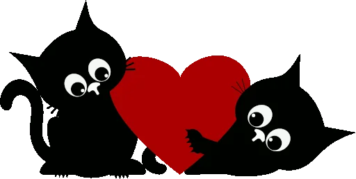

# 💖 Pedido de Namoro Interativo

**Dia dos Namorados 2026** - Frontend completo com animação!



## ✨ **Funcionalidades**
- ✅ **Botão "NÃO" foge no mouse** (JavaScript animado)
- ✅ **Design responsivo rosa** (CSS3 moderno)
- ✅ **Vídeo romântico YouTube** (botão SIM)
- ✅ **Gatinho fofo** Dia dos Namorados
- ✅ **HTML semântico validado**

## 🎮 **Como funciona**
1. Passa mouse no **"Não!"** → Botão **foge** pela tela! 😅
2. Clica **"Sim!"** → Abre vídeo romântico ❤️
3. **Totalmente responsivo** celular + desktop

## 🚀 **Para rodar**
```bash
# 1. Clona repo
git clone https://github.com/SEUUSER/pedido-namorado.git

# 2. Abre index.html
Live Server (Ctrl+Alt+L) OU duplo clique

Feito com ❤️ pro Dia dos Namorados 2026!

